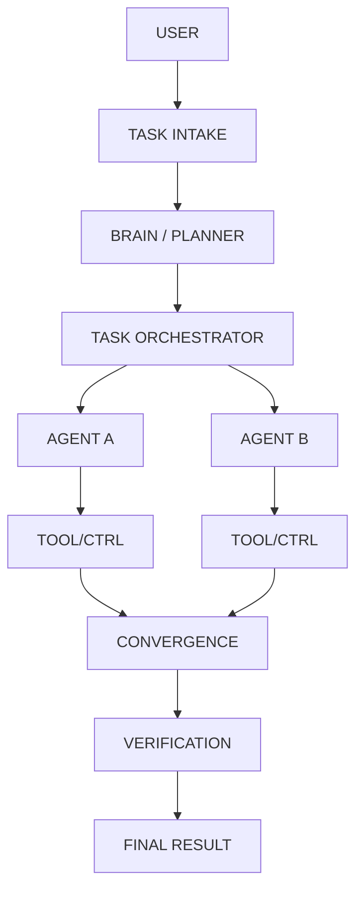

# V2_PRACTICAL_WORKFLOW_GRAPH

```mermaid
graph TD
    USER[USER] --> INTAKE[TASK INTAKE]
    INTAKE --> BRAIN[BRAIN / PLANNER]
    BRAIN --> ORCHESTRATOR[TASK ORCHESTRATOR]
    ORCHESTRATOR --> AGENT_A[AGENT A]
    ORCHESTRATOR --> AGENT_B[AGENT B]
    AGENT_A --> TOOL_A[TOOL/CTRL]
    AGENT_B --> TOOL_B[TOOL/CTRL]
    TOOL_A --> CONVERGENCE[CONVERGENCE]
    TOOL_B --> CONVERGENCE
    CONVERGENCE --> VERIFICATION[VERIFICATION]
    VERIFICATION --> RESULT[FINAL RESULT]
```
