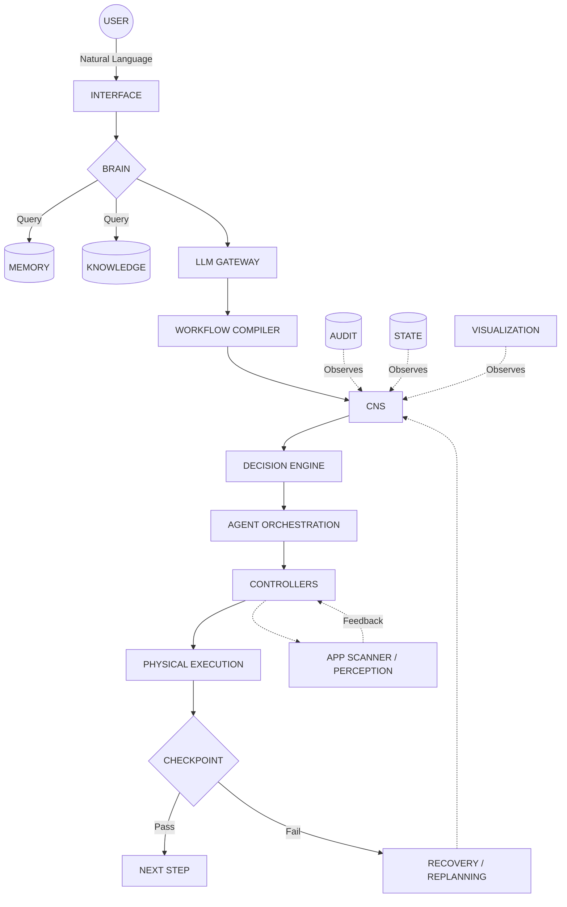

# Master Architecture Diagram

```mermaid
graph TD
    %% MASTER ARCHITECTURE
    USER((USER)) -->|Natural Language| INTERFACE[INTERFACE]
    INTERFACE --> BRAIN{BRAIN}
    BRAIN -->|Query| MEMORY[(MEMORY)]
    BRAIN -->|Query| KNOWLEDGE[(KNOWLEDGE)]
    BRAIN --> LLM_GATEWAY[LLM GATEWAY]
    LLM_GATEWAY --> COMPILER[WORKFLOW COMPILER]
    COMPILER --> CNS[CNS]
    CNS --> DECISION[DECISION ENGINE]
    DECISION --> AGENTS[AGENT ORCHESTRATION]
    AGENTS --> CONTROLLERS[CONTROLLERS]
    CONTROLLERS --> EXECUTION[PHYSICAL EXECUTION]
    CONTROLLERS -.-> PERCEPTION[APP SCANNER / PERCEPTION]
    PERCEPTION -.->|Feedback| CONTROLLERS
    EXECUTION --> CHECKPOINT{CHECKPOINT}
    CHECKPOINT -->|Pass| NEXT_STEP[NEXT STEP]
    CHECKPOINT -->|Fail| RECOVERY[RECOVERY / REPLANNING]
    RECOVERY -.-> CNS
    
    %% Observations
    AUDIT[(AUDIT)] -.->|Observes| CNS
    STATE[(STATE)] -.->|Observes| CNS
    VISUALIZATION[VISUALIZATION] -.->|Observes| CNS
```
