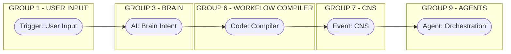

# n8n Master Workflow (Observability Model)

```mermaid
graph LR
    %% N8N STYLE WORKFLOW
    subgraph G1 [GROUP 1 - USER INPUT]
        start([Trigger: User Input])
    end
    
    subgraph G2 [GROUP 3 - BRAIN]
        brain([AI: Brain Intent])
    end
    
    subgraph G3 [GROUP 6 - WORKFLOW COMPILER]
        compiler([Code: Compiler])
    end
    
    subgraph G4 [GROUP 7 - CNS]
        cns([Event: CNS])
    end
    
    subgraph G5 [GROUP 9 - AGENTS]
        agents([Agent: Orchestration])
    end
    
    start --> brain
    brain --> compiler
    compiler --> cns
    cns --> agents
```
