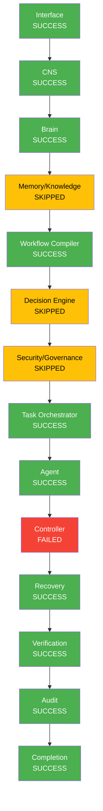

```mermaid
graph TD
  interface["Interface <br/> SUCCESS"]:::s_interface
  classDef s_interface fill:#4CAF50,color:white
  interface --> cns
  cns["CNS <br/> SUCCESS"]:::s_cns
  classDef s_cns fill:#4CAF50,color:white
  cns --> brain
  brain["Brain <br/> SUCCESS"]:::s_brain
  classDef s_brain fill:#4CAF50,color:white
  brain --> memory
  memory["Memory/Knowledge <br/> SKIPPED"]:::s_memory
  classDef s_memory fill:#FFC107,color:black
  memory --> compiler
  compiler["Workflow Compiler <br/> SUCCESS"]:::s_compiler
  classDef s_compiler fill:#4CAF50,color:white
  compiler --> decision
  decision["Decision Engine <br/> SKIPPED"]:::s_decision
  classDef s_decision fill:#FFC107,color:black
  decision --> security
  security["Security/Governance <br/> SKIPPED"]:::s_security
  classDef s_security fill:#FFC107,color:black
  security --> orchestrator
  orchestrator["Task Orchestrator <br/> SUCCESS"]:::s_orchestrator
  classDef s_orchestrator fill:#4CAF50,color:white
  orchestrator --> agent
  agent["Agent <br/> SUCCESS"]:::s_agent
  classDef s_agent fill:#4CAF50,color:white
  agent --> controller
  controller["Controller <br/> FAILED"]:::s_controller
  classDef s_controller fill:#F44336,color:white
  controller --> recovery
  recovery["Recovery <br/> SUCCESS"]:::s_recovery
  classDef s_recovery fill:#4CAF50,color:white
  recovery --> verification
  verification["Verification <br/> SUCCESS"]:::s_verification
  classDef s_verification fill:#4CAF50,color:white
  verification --> audit
  audit["Audit <br/> SUCCESS"]:::s_audit
  classDef s_audit fill:#4CAF50,color:white
  audit --> completion
  completion["Completion <br/> SUCCESS"]:::s_completion
  classDef s_completion fill:#4CAF50,color:white
```